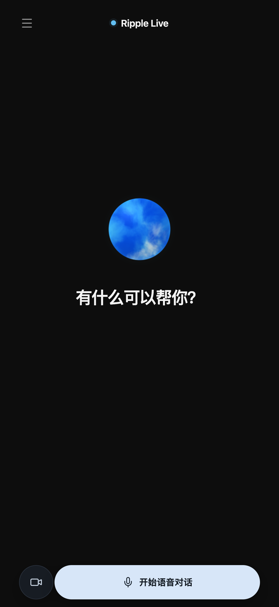
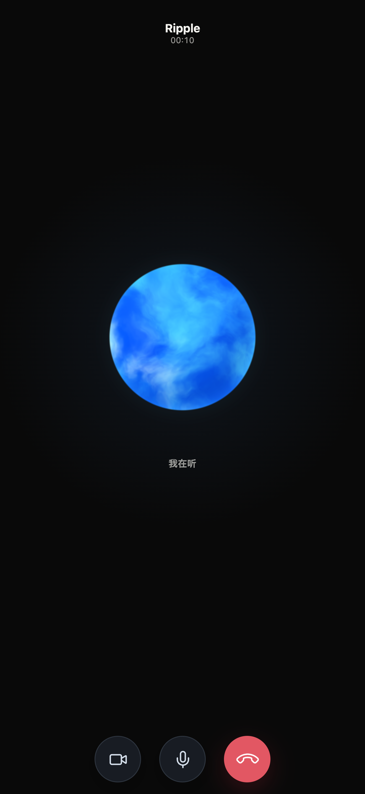
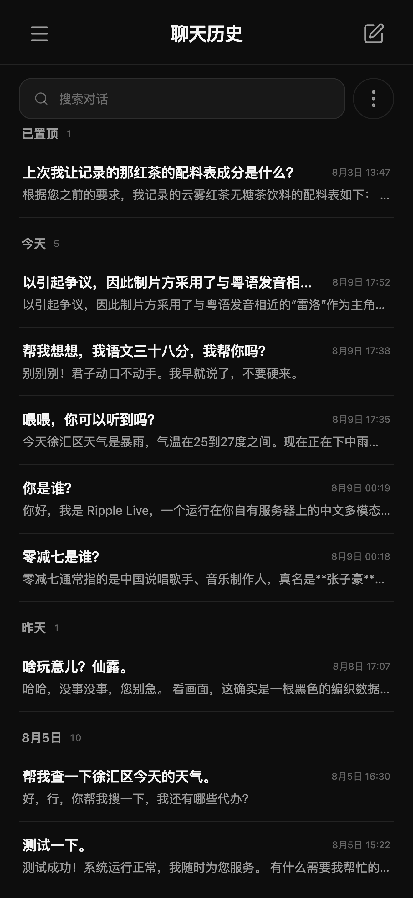
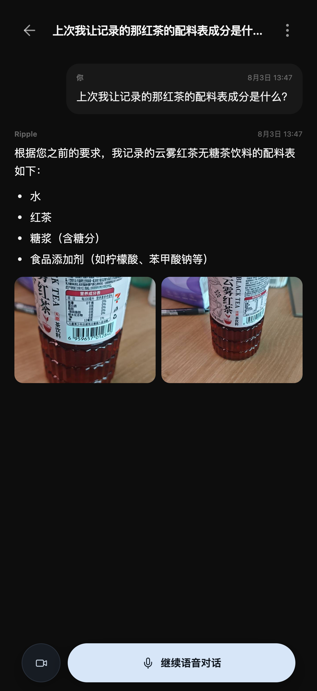
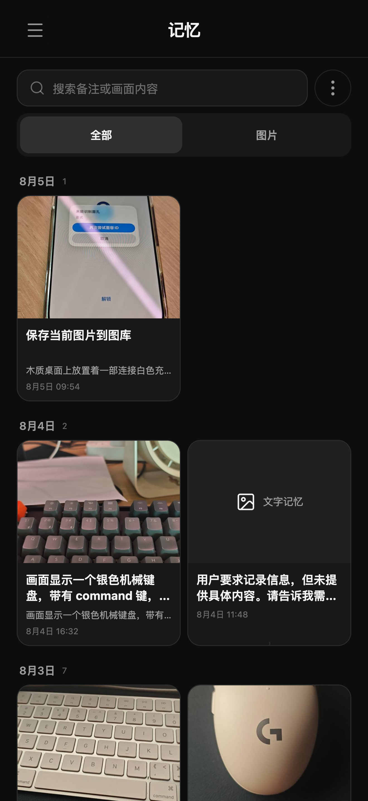
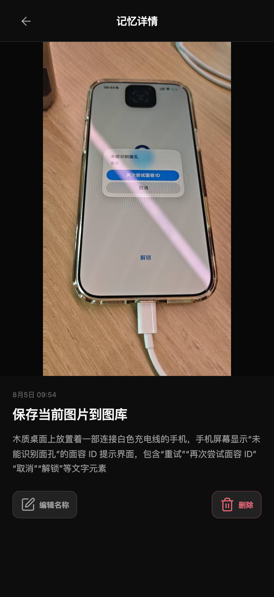
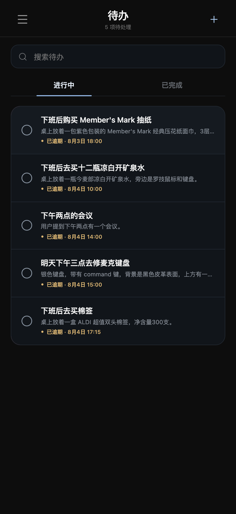
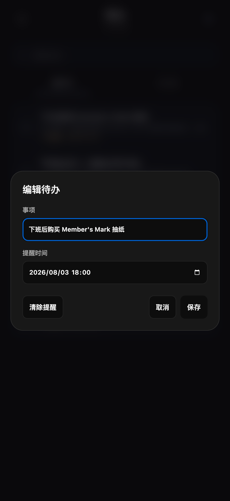
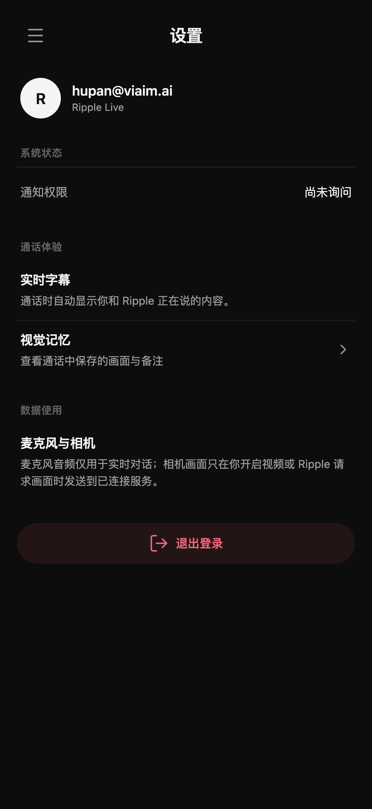

# Ripple Live

自托管、中文优先的多模态实时语音助手。在 Android 上通过语音与画面理解用户，并把对话沉淀为可搜索的历史、记忆和待办。

## 界面预览

| 首页 | 实时语音 | 聊天历史 |
| :---: | :---: | :---: |
|  |  |  |
| 对话详情 | 记忆 | 记忆详情 |
|  |  |  |
| 待办 | 待办详情 | 设置 |
|  |  |  |

## 产品能力

- **实时语音对话**：VAD、本地预滚、语义断句、可打断播放和连续音频流。
- **视觉理解**：仅在服务端接受视频轮次后按需采集摄像头画面。
- **工具调用**：支持天气、Web 搜索和可扩展的 JSON 输入/输出技能。
- **长期记忆**：保存文字和视觉记忆，并支持搜索、置顶、归档和删除。
- **待办管理**：语音创建待办，支持提醒、完成状态和右滑删除。
- **聊天历史**：按会话保存消息、附件与工具结果，可继续原有对话。
- **自有服务**：模型、会话、记忆、附件和账号数据均部署在自己的服务器上。

当前优先保证 Android APK 的功能和交付。iOS 工程代码保留，但暂不继续扩展。

## 系统架构

```text
Android 麦克风 ── 16 kHz PCM ──┐
Android 摄像头 ── sampled JPEG ─┼── Rust Agent Gateway :8700
                               │     ├── Qwen3-ASR :8711
                               │     ├── Qwen3.5-35B-A3B :8712
                               │     ├── allowlisted tools / skills
                               │     ├── SQLite conversation & memory store
Android 扬声器 ◀─ 24 kHz PCM ───┘     └── Qwen3-TTS + vLLM-Omni :8723
```

Gateway 负责会话轮次、Responses API、工具循环、上下文存储和权限边界。模型返回的结构化工具调用会先在服务端执行并记录，执行结果再交回模型生成最终文字与语音回复。

## 技术栈

| 层级 | 实现 |
| --- | --- |
| 移动端 | Tauri 2、React、TypeScript、Web Audio、WebGL 2 |
| 原生宿主 | Rust、Android WebView、Gradle |
| Agent Gateway | Rust、Responses API、WebSocket realtime |
| 语音与视觉 | Qwen3-ASR、Qwen3.5-35B-A3B、Qwen3-TTS、vLLM-Omni |
| 数据 | SQLite、本地附件存储 |
| 工具 | `SKILL.md` + `tools.json` + JSON 子进程协议 |

## 仓库结构

```text
apps/mobile/                         Tauri 2 + React 移动端
  src/                               UI、实时音视频、WebGL 动效
  src-tauri/                         Rust/Tauri 运行时与移动端配置
    gen/android/                     Android 宿主工程
services/agent-gateway/              Realtime、Responses API、工具和上下文
deploy/agent-stack/                  安装、模型下载、启动和状态脚本
skills/                              可发现的外部工具定义
docs/images/                         README 产品截图
```

## 快速开始

### 1. 部署 Agent 服务

服务端使用独立的 `uv` 环境和 Rust release 二进制，不向系统 Python 安装依赖。

```bash
./deploy/agent-stack/install.sh
./deploy/agent-stack/download-models.sh
cp deploy/agent-stack/.env.example deploy/agent-stack/.env
./deploy/agent-stack/start.sh
./deploy/agent-stack/status.sh
```

默认实时接口：

```text
ws://YOUR_SERVER_IP:8700/v1/agent/realtime
```

文本客户端使用 Responses API：

```text
POST /v1/responses
```

### 2. 本地预览移动端

```bash
cd apps/mobile
npm ci
npm run web:dev
```

打开 <http://127.0.0.1:1420>。浏览器预览与 Android WebView 使用同一套 React、媒体和 WebGL 代码。

### 3. 构建 Android APK

```bash
cd apps/mobile
./scripts/setup-android.sh
npm ci
npm run lint
npm run android:build -- --debug --target aarch64
```

产物路径：

```text
apps/mobile/src-tauri/gen/android/app/build/outputs/apk/universal/debug/app-universal-debug.apk
```

安装到 USB 连接的手机：

```bash
adb install -r apps/mobile/src-tauri/gen/android/app/build/outputs/apk/universal/debug/app-universal-debug.apk
```

Android 7.0（API 24）或更高版本。首次通话时需要授予麦克风权限，使用视频功能时还需要摄像头权限。更多移动端开发说明见 [`apps/mobile/README.md`](apps/mobile/README.md)。

## Skills 与工具扩展

Gateway 启动时会发现 `skills/*/SKILL.md` 和 `skills/*/tools.json`。技能元数据提供给模型，命令则在隔离环境中以 JSON 输入/输出子进程运行，并受超时、输出大小和轮次取消控制。

仓库自带：

- `skills/system-info`：只读系统信息示例；
- `skills/web-research`：Tavily 搜索与网页提取；
- `skills/weather`：天气查询。

按照相同目录结构增加技能，无需修改 Gateway 源码。

## 账号与邀请

Ripple Live 在开始实时对话前需要登录。服务启动前可以配置邀请代码：

```bash
RIPPLE_INVITE_CODES=first-private-code,second-private-code
RIPPLE_INVITE_MAX_USES=10
RIPPLE_INVITE_TTL_HOURS=168
```

首次注册需要邮箱、密码和邀请代码。登录成功后，客户端在本地保存可撤销的访问令牌；`RIPPLE_AUTH_TOKEN_TTL_HOURS` 默认是 720 小时。

## 安全说明

默认开发部署仍允许明文 `ws://`。音频、摄像头画面、转录、工具参数和模型回复在传输过程中未加密。对外提供服务前，应通过反向代理启用 TLS/WSS，并限制账号、会话和工具权限。
