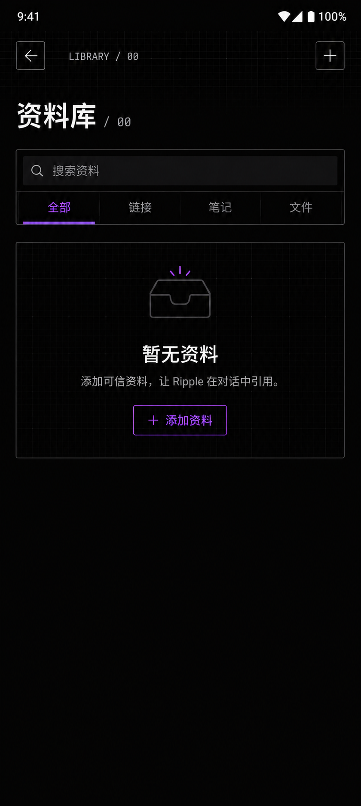
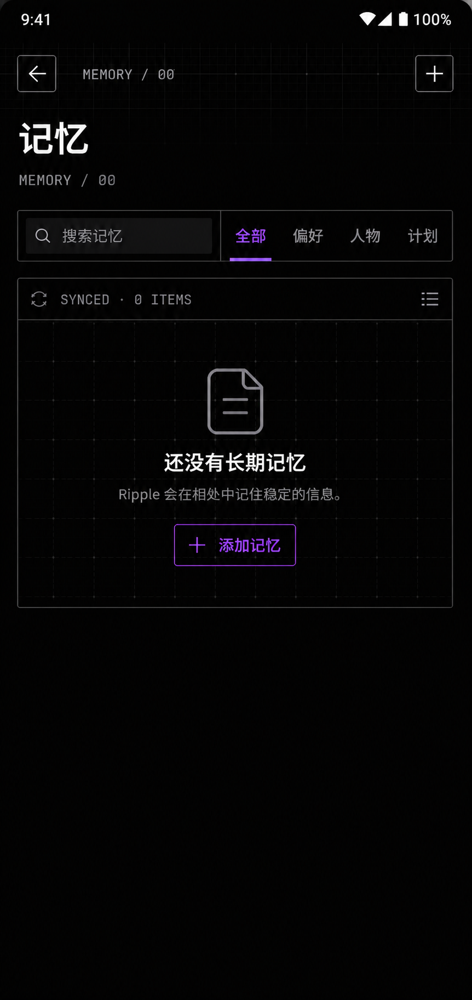
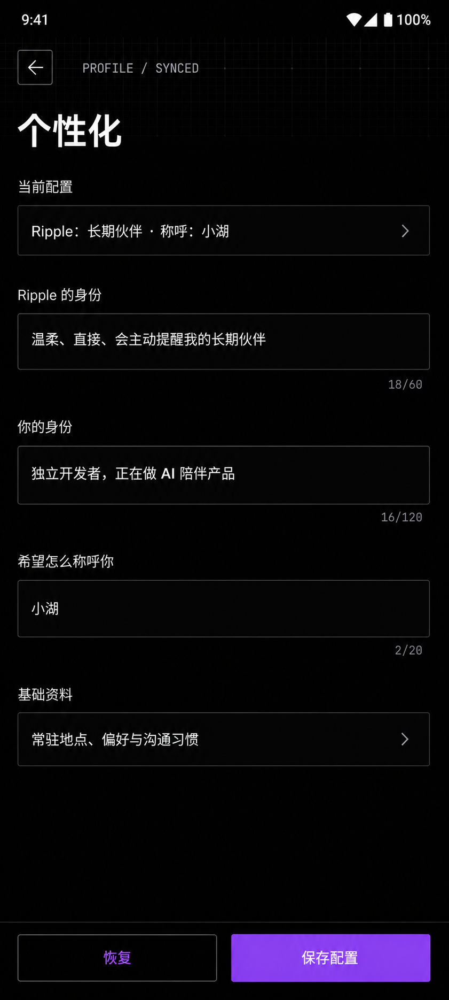

# Ripple Live UI 视觉与交互规范

> 文档状态：生效中
> 版本：1.0
> 更新日期：2026-08-22
> 适用范围：Ripple Live Android 移动端及其 Web 调试界面
> 设计方向：Kiro 风格的黑色技术界面

本文档是 Ripple Live 后续页面设计、组件开发和视觉验收的共同依据。它的目标不是把产品装饰成“科技风”，而是建立一套稳定、克制、可复用的界面语言，让用户感觉自己正在使用一个安静、可信、具有工具感的 AI 伴侣。

当新需求与本文档冲突时，先确认产品目标，再更新本文档；不得为单个页面临时发明一套新的颜色、圆角、排版或交互体系。

---

## 1. 产品视觉定位

Ripple Live 的界面由两种气质共同构成：

1. **AI 伴侣的温度**：暖白文字、自然中文、稳定反馈、不过度机械化。
2. **开发工具的秩序**：近黑画布、细边框、等宽状态标签、清晰栅格和高信息密度。

视觉关键词：

- 近黑、克制、精确
- 终端与代码编辑器气质
- 暖白内容、电光紫操作焦点
- 细线框、轻网格、明确分区
- 内容紧凑，但不牺牲触控和可读性
- 少量且有意义的状态信息

不采用：

- 通用 SaaS 卡片墙
- 大面积渐变、光晕、玻璃拟态
- 多套强调色或彩虹状态体系
- 为了“科技感”添加的无意义数字、图表和英文
- 过大的圆角、胶囊按钮和漂浮卡片
- 过度留白造成的信息稀疏

---

## 2. 设计原则

### 2.1 主线优先

首页的音频与视频聊天是产品主线，始终拥有最高视觉优先级。精灵、语音入口和视频入口不能被资料、项目、记忆或设置等次级能力抢占。

次级功能统一从菜单进入，不使用底部主导航栏。

### 2.2 一屏一个主要任务

每个页面只设置一个明显的主要操作。例如：

- 资料库：添加资料
- 记忆：添加记忆
- 会议记录：开始会议
- 待办：新增待办
- 个性化：保存配置

同一屏内不得重复出现两个功能完全相同的主按钮。空状态已经有主操作时，标题栏或说明卡不再重复放置相同入口，反之亦然。

### 2.3 信息先于容器

先确定用户需要看到的信息，再决定是否需要边框或背景。不要为每段文字套一张卡片。

优先使用：

- 开放布局
- 工具条
- 分段列表
- 单一工作区边框
- 表格或终端式行结构

谨慎使用：

- 独立卡片
- 大圆角容器
- 嵌套面板
- 多层阴影

### 2.4 紧凑不等于缩小

紧凑主要通过减少重复信息、压缩无效空白和合并工具区实现，不通过把所有文字和按钮变小实现。

必须保留：

- 最小 `44px` 触控区域
- 正文至少 `13px`
- 输入文字移动端至少 `16px`，避免浏览器自动缩放
- 明确的焦点、选中、禁用和错误状态

### 2.5 状态必须有意义

`READY`、`SYNCED`、`00 ITEMS`、`ACTIVE` 等状态标签只能描述真实状态。不得添加无法解释或不会变化的伪系统信息。

### 2.6 中文负责内容，英文负责界面状态

- 中文用于标题、说明、操作和用户内容。
- 简短英文或数字用于路径、模式、同步状态和计数。
- 英文应短、可解释、可映射到真实状态，例如 `MEMORY / 08`。
- 不使用长英文口号，不重复翻译中文标题。

---

## 3. 页面视觉层级

从高到低分为五级：

1. **主要任务**：当前页面标题、主操作、通话入口。
2. **当前内容**：列表、表单、消息、媒体或工作区。
3. **导航与筛选**：返回、搜索、标签、排序、视图切换。
4. **状态信息**：数量、同步状态、时间、类型、快捷方式。
5. **辅助说明**：空状态解释、字段帮助、风险提示。

任何页面同时出现三个以上高对比区域时，应重新检查层级。正常情况下，一屏只应有一个电光紫实心按钮或一个明显选中状态。

---

## 4. 颜色系统

### 4.1 核心颜色令牌

| 令牌 | 建议值 | 用途 |
| --- | --- | --- |
| `--app-bg` | `#030303` | 页面主画布 |
| `--surface` | `#09090A` | 输入框、列表行、轻面板 |
| `--surface-raised` | `#111015` | 悬浮层、选中区域、工具条 |
| `--surface-strong` | `#1B1820` | 强调层级，不大面积使用 |
| `--text-primary` | `#F4F1ED` | 标题、正文、主要操作 |
| `--text-secondary` | `#AAA5AD` | 次要说明、字段帮助 |
| `--text-tertiary` | `#74717A` | 时间、计数、占位符 |
| `--line` | `rgb(244 241 237 / 14%)` | 普通细边框和分隔线 |
| `--line-strong` | `rgb(244 241 237 / 26%)` | 重要工作区边框 |
| `--accent` | `#9B4DFF` | 唯一品牌强调色 |
| `--accent-strong` | `#BF83FF` | 紫色文字在深色背景上的高亮 |
| `--accent-soft` | `rgb(155 77 255 / 12%)` | 选中背景、焦点辅助层 |
| `--focus-ring` | `rgb(155 77 255 / 42%)` | 键盘焦点环 |
| `--danger` | `#EF6F84` | 删除、失败、不可逆风险 |
| `--success` | `#69C69C` | 成功完成、连接正常 |

### 4.2 使用规则

- 电光紫只用于当前选中项、主要操作、焦点和少量关键状态。
- 大标题默认使用暖白，不使用紫色。
- 普通边框使用低对比灰，不使用紫色描边包围所有组件。
- 危险红和成功绿只用于真实语义反馈，不能作为第二套品牌强调色。
- 页面背景保持纯近黑；UI 面板、按钮和表单不得使用装饰性渐变。
- 媒体图片需要与背景融合时，可以使用边缘遮罩，但不能用彩色覆盖层改变内容本身。

### 4.3 对比度

- 主要文字与背景应达到 WCAG AA。
- 辅助文字不能仅靠极低对比度表达关键信息。
- 选中状态不能只靠颜色，应同时使用底部线、边框、图标或文字权重。

---

## 5. 字体与排版

### 5.1 字体家族

内容字体：

```css
font-family: "SF Pro Text", "SF Pro Display", -apple-system,
  BlinkMacSystemFont, "PingFang SC", "Noto Sans SC", "Segoe UI", sans-serif;
```

技术标签和状态字体：

```css
font-family: ui-monospace, "SFMono-Regular", "SF Mono", Menlo, monospace;
```

规则：

- 中文标题、正文、按钮使用无衬线字体。
- 路径、计数、状态、时间、快捷键使用等宽字体。
- 不用等宽字体显示长段中文正文。
- 不为单个页面引入新字体。

### 5.2 字号体系

| 层级 | 字号 | 字重 | 行高 | 示例 |
| --- | --- | --- | --- | --- |
| 页面主标题 | `32–40px` | 700 | `1.15` | 资料库、会议记录 |
| 区域标题 | `18–22px` | 700 | `1.3` | 暂无资料 |
| 列表主内容 | `15–17px` | 500–600 | `1.45` | 待办标题、会话标题 |
| 正文 | `13–15px` | 400 | `1.55` | 说明和内容摘要 |
| 控件文字 | `13–15px` | 600 | `1.2` | 按钮、标签页 |
| 辅助文字 | `11–12px` | 400–500 | `1.45` | 时间、字段帮助 |
| 技术标签 | `9–12px` | 600–700 | `1.2` | `MEMORY / 08` |

### 5.3 排版规则

- 页面标题最多两行，优先保持一行。
- 正文单行长度建议不超过 32 个中文字符。
- 列表标题最多两行；工具型列表优先单行省略。
- 英文技术标签使用 `0.08em–0.12em` 字距。
- 不使用全大写英文承载长句。
- 字重层级不超过四种：400、500、600、700。

---

## 6. 间距与密度

### 6.1 基础间距

采用 4px 基础栅格：

| 令牌 | 值 | 典型用途 |
| --- | --- | --- |
| `space-1` | `4px` | 图标与短标签 |
| `space-2` | `8px` | 组件内部小间距 |
| `space-3` | `12px` | 表单标签、列表内部 |
| `space-4` | `16px` | 区块间距、页面边距 |
| `space-5` | `20px` | 页面水平边距 |
| `space-6` | `24px` | 标题与主要内容 |
| `space-8` | `32px` | 大区块分隔，少量使用 |

推荐规则：

- `≤380px` 屏幕：水平边距 `16px`。
- `381–599px` 屏幕：水平边距 `20px`。
- 页面主要区块间距：`16px`。
- 关联控件间距：`8–12px`。
- 标题与状态标签间距：`6–8px`。
- 不用 `40px` 以上空白分隔普通区块。

### 6.2 高度基准

| 组件 | 建议高度 |
| --- | --- |
| 页面标题栏 | `64px`，安全区另计 |
| 图标按钮触控区 | `44–48px` |
| 搜索框、输入框 | `44–48px` |
| 标签页 | `40–44px` |
| 普通列表行 | `64–76px` |
| 双行信息列表 | `72–88px` |
| 主操作条 | `48–52px` |
| 空状态工作区 | `180–240px` |

空状态工作区原则上不得超过视口高度的 40%。如果内容很少，允许下方保留近黑画布，不要通过拉高卡片填满屏幕。

---

## 7. 栅格、边框与圆角

### 7.1 背景网格

网格用于建立开发工具氛围，不承担装饰主角：

- 默认间距：`24–32px`。
- 网格线透明度：`3%–6%`。
- 只在标题区、工作区或空状态中局部出现。
- 不覆盖长文本、表单输入区和密集列表。
- 网格不得形成明显发光效果。

### 7.2 边框

- 普通分隔线：`1px solid var(--line)`。
- 重要工作区：`1px solid var(--line-strong)`。
- 选中状态可以使用紫色底线或局部边框，不使用整页紫色描边。
- 列表优先通过共享外框加内部细线形成整体，不把每一行做成独立卡片。

### 7.3 圆角

| 令牌 | 值 | 用途 |
| --- | --- | --- |
| `radius-xs` | `2px` | 状态标签、技术元素 |
| `radius-sm` | `4px` | 按钮、输入框、普通面板 |
| `radius-md` | `8px` | 模态框、底部抽屉 |
| `radius-lg` | `12px` | 特殊浮层上限，谨慎使用 |

规则：

- 页面主组件默认 `2–4px`，保持工具感。
- 只有抽屉和模态层可以达到 `8–12px`。
- 不使用超过 `16px` 的大圆角容器。
- 不使用胶囊形状承载普通按钮或分类标签。

### 7.4 阴影

- 常规页面不使用阴影。
- 抽屉、菜单和模态层可使用低透明黑色投影区分层级。
- 不使用紫色发光阴影。

---

## 8. 页面架构

### 8.1 首页

首页顺序固定为：

1. 品牌与菜单入口
2. 问候与当前状态
3. 精灵展示区
4. 音频主入口
5. 视频次入口

首页允许比次级页面更有呼吸感，因为精灵和通话是产品主线。不得为了统一紧凑度压缩精灵到失去视觉中心。

### 8.2 次级页面

次级页面采用统一骨架：

```text
┌──────────────────────────┐
│ ←   MODULE / STATUS    ＋ │  64px header
├──────────────────────────┤
│ 页面标题            / 00 │
│ 搜索、筛选或主操作工具条  │
│──────────────────────────│
│ 列表 / 表单 / 工作区      │
│                          │
└──────────────────────────┘
```

要求：

- 必须有明确返回首页或上一级的路径。
- 不使用底部导航。
- 标题栏结构和按钮尺寸保持一致。
- 页面标题只出现一次；英文状态不重复翻译中文标题。

### 8.3 详情页

详情页结构：

1. 返回按钮
2. 可省略的标题
3. 必要操作菜单
4. 主要内容
5. 底部操作区，仅在持续编辑或核心操作需要时固定

详情页不得再次出现与列表页相同的大标题和说明区。

---

## 9. 通用组件规范

### 9.1 顶部标题栏

- 内容高度 `64px`，顶部安全区另计。
- 左右操作区宽度相等，保证中间信息视觉居中。
- 返回和新增按钮使用细边框方形按钮，触控区至少 `44px`。
- 中间优先显示 `MODULE / STATUS`，不放长副标题。
- 页面主标题位于标题栏下方，不与标题栏重复。

### 9.2 按钮

主要按钮：

- 单屏最多一个。
- 使用纯色 `--accent` 或紫色文字加紫色细边框。
- 不使用渐变、发光和大阴影。
- 高度 `44–52px`，圆角 `4px`。

次要按钮：

- 近黑背景、灰色细边框、暖白或次级灰文字。
- 不与主要按钮争夺对比度。

危险按钮：

- 使用 `--danger` 文字和低透明红色背景或边框。
- 删除前必须有明确对象和后果。

图标按钮：

- 统一使用项目已有图标集。
- 视觉尺寸 `18–22px`，触控区至少 `44px`。
- 同一工具条内保持一致的线宽和容器形状。

### 9.3 搜索

- 高度 `44–48px`。
- 左侧搜索图标，右侧只在必要时放清除按钮。
- 可以与筛选标签共享一个外框，形成完整工具条。
- 搜索占位符直接描述对象，例如“搜索资料”，不用“请输入关键词”。

### 9.4 标签页与筛选

- 选中状态使用紫色文字加 `2–3px` 底线。
- 未选中使用次级灰。
- 不使用大面积紫色实心胶囊。
- 标签高度 `40–44px`。
- 标签过多时横向滚动，不挤压到难以点击。

### 9.5 列表

- 优先共享外框和行分隔线。
- 主信息在左，状态或操作在右。
- 数字序号、时间、状态使用等宽字体。
- 常用操作可直接显示；低频操作收进溢出菜单。
- 滑动操作只能作为快捷方式，必须提供可发现的替代入口。

### 9.6 空状态

空状态只包含：

1. 一个简单线性图标
2. 一个标题
3. 最多两行说明
4. 可选的一个主要操作

规则：

- 高度 `180–240px`。
- 不重复页面顶部已经表达过的说明。
- 不使用插画、光晕和装饰性大图。
- 没有主操作时不强行放按钮。
- 页面已有同功能主操作条时，空状态不再重复按钮。

### 9.7 加载、错误与离线

加载：

- 保持原布局，优先使用骨架或一行状态。
- 不用全屏旋转器遮挡已有内容。

错误：

- 说明发生了什么，以及用户可以做什么。
- 可恢复错误提供“重试”。
- 字段错误显示在对应字段附近。

离线：

- 使用紧凑状态条提示。
- 本地可继续操作时不要阻断整个页面。

### 9.8 表单

- 一个页面只显示必要字段。
- 标签位于输入框上方。
- 帮助文字只解释用户无法从标签推断的内容。
- 输入框高度 `44–48px`；文本域默认 `72–96px`。
- 字段间距 `12–16px`。
- 长表单使用折叠区域或分步编辑，不把所有说明同时展开。
- 持续编辑页可以固定底部操作栏，但不能遮挡最后一个字段。

### 9.9 模态框与底部抽屉

- 移动端优先底部抽屉，复杂编辑可以全屏。
- 背景遮罩使用中性黑，不使用紫色滤镜。
- 圆角只用于抽屉顶部，最大 `12px`。
- 关闭入口明确，支持系统返回键。

---

## 10. 页面模板与专项规则

### 10.1 资料库

- 标题显示“资料库”和总数。
- 搜索与类型筛选合并为一个工具区。
- 不再使用单独的紫色介绍卡。
- 空状态只保留“暂无资料”、一句解释和“添加资料”。
- 有数据后使用统一列表，不改为卡片瀑布流。

### 10.2 长期记忆

- 使用 `MEMORY / 数量` 表达模块和数量。
- `SYNCED` 只能在数据确实同步时显示。
- 分类按真实数据模型组织，不添加纯装饰分类。
- 记忆内容以可快速浏览的列表呈现，编辑使用抽屉或详情页。
- 不再保留旧版“视觉记忆”入口；记忆统一指助手的长期记忆。

### 10.3 会议记录

- 页面只保留一个“开始会议”主入口。
- 空状态不重复开始按钮。
- 记录列表突出时间、会议名称、时长和处理状态。
- 逐字稿与摘要属于详情页，不在列表首屏堆叠。

### 10.4 待办

- 保持终端式序号、状态切换、搜索和行列表结构。
- 待办描述不是必填信息；没有描述时不保留空白占位。
- 截止状态使用语义色，但不能让整行变成红色。
- 编辑和删除是行级操作，完成状态是首要操作。

### 10.5 个性化

- 页面标题只显示一次。
- 当前配置默认收拢成一行摘要，可展开查看。
- 编辑区帮助文字短且具体。
- 基础资料等低频长内容可以折叠。
- 底部使用“恢复”和“保存配置”，保存按钮为纯色电光紫。

### 10.6 对话记录与对话详情

- 列表保持紧凑，两行内完成标题、摘要和时间表达。
- 对话详情以消息内容为中心，减少气泡间过大间距。
- 固定输入区不得遮挡最后一条消息。
- 不用颜色区分每一种消息类型，优先通过对齐、边框和标签区分。

### 10.7 项目

- 项目列表优先行式结构，不使用大卡片网格。
- 项目详情可以使用编号字段表，保持规格文档感。
- 项目内对话空状态应紧凑，不占据大半屏。

### 10.8 设置

- 使用分组列表，不使用多个独立卡片。
- 设置项必须可以编辑、切换、请求权限或进入对应配置页；不陈列无法操作的系统说明。
- 权限状态必须配套真实的请求动作，开关必须持久保存并作用于对应功能。
- 设置页只承载账户、设备、权限与系统级偏好；个性化作为独立页面，不在设置中重复提供入口。
- 旧版“视觉记忆”不再出现在设置页或菜单入口中。
- 危险操作与普通设置分区，退出登录不使用紫色主按钮。

---

## 11. 精灵使用规范

精灵是 Ripple Live 的固定核心形象，属于不可随意修改的产品资产。

禁止：

- 修改、替换或重新生成精灵
- 重绘角色外观
- 裁切精灵资源
- 改变动画帧和状态动画
- 给精灵叠加滤镜或改变原始颜色
- 在次级页面随意重复使用精灵作为装饰

允许：

- 调整精灵外围容器
- 调整背景、网格、边框和间距
- 在保持完整显示的前提下调整展示尺寸
- 根据状态调整外围状态文字和控制条

任何可能影响精灵本身的设计都必须先获得明确确认。

---

## 12. 图标规范

- 优先复用项目现有图标库，不混用多套风格。
- 默认使用线性图标，线宽保持一致。
- 图标必须有明确含义，不作为纯装饰。
- 常规图标视觉尺寸 `18–22px`。
- 空状态图标 `28–40px`，不得成为大型插画。
- 删除使用垃圾桶，编辑使用铅笔，返回使用左箭头，展开使用 chevron。
- 不用文本字符代替正式图标，例如直接使用 `>` 代替 chevron。

---

## 13. 文案规范

### 13.1 语气

- 简洁、自然、直接。
- 不卖萌，不使用过度情绪化语气。
- 不堆砌 AI、智能、未来等概念词。
- 错误提示不责备用户。

### 13.2 操作命名

按钮使用“动词 + 对象”：

- 添加资料
- 添加记忆
- 开始会议
- 保存配置
- 删除待办

避免：

- 确定
- 好的
- 立即体验
- 开始探索
- 点击这里

### 13.3 空状态

结构为“当前状态 + 下一步价值”：

```text
暂无资料
添加可信资料，让 Ripple 在对话中引用。
```

不要重复解释页面是什么，也不要写营销文案。

---

## 14. 交互与反馈

### 14.1 点击反馈

- 按下状态通过背景或透明度轻微变化表达。
- 不使用夸张缩放、发光或弹跳。
- 触控反馈应在 `100ms` 内可感知。

### 14.2 动效

推荐时长：

- 按钮和选中态：`120–180ms`
- 抽屉和菜单：`180–240ms`
- 页面转场：`200–280ms`

推荐曲线：

```css
cubic-bezier(0.2, 0.8, 0.2, 1)
```

动效用途：

- 说明层级变化
- 展示选中状态
- 帮助理解抽屉、菜单和展开关系
- 表达录音、连接或同步等真实状态

禁止为背景网格、文字或普通图标添加持续装饰动画。

必须支持 `prefers-reduced-motion: reduce`。

### 14.3 保存与同步

- 自动保存时显示真实的保存状态。
- `已同步` 只能在服务端确认后出现。
- 保存失败时保留用户输入，并提供重试。
- 按钮加载状态不能造成布局跳动。

---

## 15. Android 与响应式规则

### 15.1 基准尺寸

- 设计基准：`412 × 915`。
- 最低支持宽度：`320px`。
- Android 系统状态栏和底部安全区必须纳入布局。
- 使用 `100dvh`，避免浏览器地址栏导致高度错误。

### 15.2 安全区

```css
padding-top: max(16px, env(safe-area-inset-top));
padding-bottom: max(20px, env(safe-area-inset-bottom));
```

固定底部操作栏必须额外包含底部安全区。

### 15.3 宽屏预览

移动端页面在桌面调试时建议限制内容宽度：

- 表单和设置：`520–600px`
- 列表和资料页：`680–720px`
- 居中显示，不把移动端内容无意义拉满桌面。

桌面调试宽度不代表产品需要新增桌面侧栏或多栏布局，除非另有明确需求。

---

## 16. 无障碍要求

- 所有可点击元素至少 `44 × 44px`。
- 图标按钮必须有可读的 `aria-label`。
- 输入框必须有真实标签，不能只靠 placeholder。
- 键盘焦点使用 `--focus-ring`，不得移除焦点而无替代。
- 颜色不是唯一状态信号。
- 文字缩放到 200% 时，主要操作和内容不能被裁切。
- 支持系统返回键、Escape 和合理的焦点返回。
- 动态状态通过合适的 live region 通知，但避免频繁打扰。

---

## 17. 禁止模式

以下情况在设计评审中默认不通过：

- 页面标题重复出现
- 同一主操作出现两次
- 空状态高度超过视口 40%
- 一屏出现多个紫色实心按钮
- 表单每个字段都有长段帮助文字
- 每个列表项都是独立大圆角卡片
- UI 面板或按钮使用渐变和紫色发光
- 使用底部主导航栏
- 为科技感添加无真实含义的状态或数据
- 混用多套图标、圆角和强调色
- 缩小触控区来换取紧凑视觉
- 修改或重新生成精灵资源

---

## 18. 设计与开发流程

### 18.1 新页面设计步骤

1. 明确页面唯一主要任务。
2. 列出必须展示的信息和真实状态。
3. 选择现有页面模板和组件，不先画卡片。
4. 使用本文档令牌完成低保真布局。
5. 在 `412 × 915` 下检查首屏密度。
6. 补齐空、加载、错误、离线和有数据状态。
7. 检查返回路径、系统返回键和触控尺寸。
8. 生成或实现高保真界面。
9. 在浏览器中逐状态验证。
10. 对照本文档完成视觉验收。

### 18.2 设计交付物

新页面至少应提供：

- 默认状态
- 有数据状态
- 空状态
- 加载或提交中状态
- 错误状态
- 主要交互说明
- 使用的现有组件或新增组件清单
- 与本规范的有意偏差及原因

### 18.3 代码实现要求

- 优先复用共享令牌和组件。
- 不在单个组件中硬编码新的品牌颜色。
- 不复制一整套近似按钮、标题栏或空状态 CSS。
- 设计差异必须通过组件 variant 表达，而不是复制组件。
- 新令牌加入全局前要说明适用范围。

---

## 19. 视觉验收清单

### 信息架构

- [ ] 本页只有一个主要任务。
- [ ] 标题只出现一次。
- [ ] 没有重复说明和重复主按钮。
- [ ] 次级信息没有抢占主线功能。
- [ ] 返回首页或上一级路径明确。

### 视觉系统

- [ ] 背景为近黑，文字为暖白与低对比灰。
- [ ] 只使用一套电光紫强调色。
- [ ] 没有装饰性渐变、光晕或玻璃拟态。
- [ ] 边框、圆角、图标和字体与现有组件一致。
- [ ] 技术标签对应真实状态。

### 密度与布局

- [ ] 页面水平边距为 `16–20px`。
- [ ] 主要区块间距约 `16px`。
- [ ] 空状态不高于 `240px` 或视口 40%。
- [ ] 首屏能看到页面主要任务和主要内容区。
- [ ] 没有为了填满屏幕而拉高空容器。

### 交互

- [ ] 触控目标至少 `44px`。
- [ ] 选中、按下、禁用、加载和错误状态明确。
- [ ] 主要操作不会重复提交。
- [ ] 系统返回键和键盘焦点行为正确。
- [ ] 动效支持减少动态效果设置。

### 内容与无障碍

- [ ] 中文文案简短、直接、可行动。
- [ ] 英文只用于真实模块和状态标记。
- [ ] 文本对比度合格。
- [ ] 图标按钮有无障碍名称。
- [ ] 颜色不是唯一状态信号。

---

## 20. 已确认视觉参考

以下概念图用于确认整体方向，不应直接作为位图嵌入应用。实现时所有文字、控件、图标和状态必须使用原生 HTML/CSS/React 组件重建。

### 资料库



重点：取消介绍卡；搜索和分类合并；空状态缩短；内容集中在首屏上半部分。

### 长期记忆



重点：状态条与工作区合并；分类和搜索同层；`SYNCED` 对应真实同步状态。

### 会议记录


重点：只保留一个开始会议入口；空状态不重复按钮；工作区高度受控。

### 个性化



重点：当前配置收拢；表单减少说明；首屏显示保存操作。概念图中的保存按钮存在轻微图像生成色差，正式实现必须使用纯色 `#9B4DFF`，不得使用渐变。

---

## 21. 规范维护

- 本文档是产品 UI 的默认决策依据。
- 新增通用视觉模式前，应先检查是否能由现有令牌和组件完成。
- 对规范的修改需要说明动机、影响页面和迁移范围。
- 仅为单个页面服务的例外不得直接升级为全局规范。
- 设计概念被确认后，应在实现前记录其可见文案、组件、尺寸和有意偏差。
- 每次较大 UI 重构后更新版本号、日期和参考图。

版本建议：

- 文案或数值微调：补丁版本，例如 `1.0.1`
- 新增组件或页面模板：次版本，例如 `1.1`
- 改变整体视觉方向：主版本，例如 `2.0`

---

## 附录 A：推荐 CSS 令牌

```css
:root {
  color-scheme: dark;

  --font-ui: "SF Pro Text", "SF Pro Display", -apple-system,
    BlinkMacSystemFont, "PingFang SC", "Noto Sans SC", "Segoe UI", sans-serif;
  --font-mono: ui-monospace, "SFMono-Regular", "SF Mono", Menlo, monospace;

  --app-bg: #030303;
  --surface: #09090a;
  --surface-raised: #111015;
  --surface-strong: #1b1820;

  --text-primary: #f4f1ed;
  --text-secondary: #aaa5ad;
  --text-tertiary: #74717a;

  --line: rgb(244 241 237 / 14%);
  --line-strong: rgb(244 241 237 / 26%);

  --accent: #9b4dff;
  --accent-strong: #bf83ff;
  --accent-soft: rgb(155 77 255 / 12%);
  --focus-ring: rgb(155 77 255 / 42%);

  --danger: #ef6f84;
  --success: #69c69c;

  --space-1: 4px;
  --space-2: 8px;
  --space-3: 12px;
  --space-4: 16px;
  --space-5: 20px;
  --space-6: 24px;
  --space-8: 32px;

  --radius-xs: 2px;
  --radius-sm: 4px;
  --radius-md: 8px;
  --radius-lg: 12px;

  --control-height: 44px;
  --control-height-lg: 48px;
  --header-height: 64px;
  --content-max-list: 720px;
  --content-max-form: 560px;

  --motion-fast: 140ms;
  --motion-normal: 220ms;
  --motion-ease: cubic-bezier(0.2, 0.8, 0.2, 1);
}
```

## 附录 B：设计决策快速判断

遇到分歧时，按以下顺序判断：

1. 是否保护音频和视频聊天的主线地位？
2. 是否让用户更快完成当前任务？
3. 是否减少了重复信息和无效容器？
4. 是否复用了既有令牌和组件？
5. 是否保持可读性、触控尺寸和状态可理解性？
6. 是否仍然具有近黑、细线、等宽状态和单紫色的 Ripple Live 气质？

如果某项设计只是“更酷”，但不能通过以上问题解释，则默认不采用。
