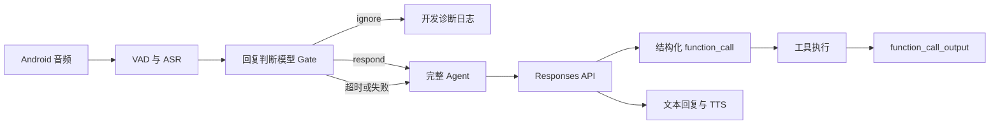

# Responses API、模型回复判断与 Android 单链路设计

日期：2026-08-04  
状态：已确认，待实施

## 1. 背景

Ripple Live 当前存在三类需要收敛的问题：

1. 模型上游实际仍使用 Chat Completions 工具调用格式，并通过文本中的 `<tool_call>` 标签补偿部分模型输出；这与对外宣称的 Responses API 语义不一致。
2. 实时协议仍保留旧客户端推断、旧事件和双分支序列化；快速开发阶段不再需要这些兼容层。
3. Android 语音链路仍依赖唤醒词和唤醒窗口决定是否回复；目标是让模型根据当前语音和近期对话自行判断。

本轮只交付服务端和 Android 链路。iOS 代码保留但冻结，不参与协议兼容、构建和回归。

## 2. 目标

- 模型上游统一使用 Responses API 的结构化工具调用语义。
- 删除 `<tool_call>` 文本解析和 Chat Completions 工具调用兼容代码。
- 删除旧实时客户端兼容，只维护严格的协议 v3。
- 删除唤醒词、唤醒模式和唤醒窗口。
- 每段有效语音先由独立模型判断是否应该回复。
- 被忽略的语音不进入用户对话，不请求画面，也不触发工具或 TTS。
- Gate 故障时优先保障用户可用性，自动进入完整 Agent。
- 仅构建、测试和验收 Android arm64 Debug 链路。

## 3. 非目标

- 本轮不升级或回归 iOS。
- 不把移动端实时音频传输改造成 HTTP Responses API。
- 不在本轮确定生产环境日志脱敏和保留周期。
- 不保留旧协议、旧字段、旧事件或旧客户端的迁移窗口。

## 4. 总体架构



移动端 WebSocket 是 Ripple 自有的实时传输协议，负责音频、事件和播放控制；模型侧 `/v1/responses` 是 Gateway 与模型服务之间的推理协议。两层协议保持独立。

## 5. 回复判断 Gate

### 5.1 输入

每个通过 VAD 且得到非空 ASR 文本的语音片段进入 Gate。Gate 输入包括：

- 当前 ASR 文本；
- 最近 2 至 4 轮用户与助手对话；
- 助手是否刚刚完成一次回复；
- 用于约束判断标准的系统指令。

Gate 阶段不请求、不采集、也不上传摄像头画面。

### 5.2 输出

Gate 必须返回结构化结果：

```json
{
  "decision": "respond",
  "reason": "direct_question"
}
```

`decision` 只允许：

- `respond`：进入完整 Agent；
- `ignore`：终止当前语音片段的处理。

`reason` 使用短的机器可读分类，至少覆盖直接提问、上下文追问、明确指令、背景对话和无意义语音。

### 5.3 ignore 行为

Gate 返回 `ignore` 后：

- 不创建用户可见对话消息；
- 不写入 Agent 对话历史；
- 不请求摄像头画面；
- 不调用任何工具；
- 不生成文本回复或 TTS；
- 仅在开发环境写入结构化诊断日志和指标。

### 5.4 故障降级

Gate 超时、网络错误、模型错误、空输出或结构化解析失败时采用 `fail-open`：

- 当前语音直接进入完整 Agent；
- 日志设置 `gate_fallback=true`；
- 记录错误分类和 Gate 耗时；
- Gate 故障不得导致实时会话永久等待或静默。

## 6. Responses API 工具调用

### 6.1 请求和响应

Gateway 到模型服务统一使用 `POST /v1/responses`。

工具循环使用 Responses API 原生条目：

1. 从响应 `output[]` 中读取 `type = "function_call"`；
2. 使用 `name`、`arguments` 和 `call_id` 执行工具；
3. 将工具结果作为 `type = "function_call_output"`、相同 `call_id` 的输入条目回传；
4. 重复循环直到返回最终助手文本或达到既有工具循环上限。

### 6.2 必须删除的兼容层

- `<tool_call>...</tool_call>` 文本扫描和 JSON 提取；
- Chat Completions `message.tool_calls` 解析；
- 流式 `tool_calls` delta 拼接；
- `role = "tool"` 结果消息构造；
- Gateway 上游 `/v1/chat/completions` 工具调用适配器；
- 证明上述旧格式可执行的测试。

模型普通文本中即使出现字面量 `<tool_call>`，也只能作为文本展示，绝不能触发工具执行。

## 7. 实时协议 v3

Android 与服务端同批升级到严格的 `protocol_version = 3`。

- 客户端连接时必须声明版本 3；
- 缺失版本或版本不匹配时，服务端返回明确协议错误并终止会话；
- 服务端不再根据首帧、字段形状或事件名称推断旧客户端；
- 删除 legacy frame、字段别名和双分支序列化；
- 删除旧客户端兼容测试。

协议 v3 不再包含唤醒状态或 Gate 内部判断事件。Gate 是服务端编排细节，不作为 Android 可配置模式。

## 8. 删除唤醒词机制

服务端删除：

- 硬编码唤醒词和显式命令；
- `Wake`、`Continuous` 等激活模式；
- `awake_until` 和追问窗口；
- 睡眠指令与唤醒状态；
- `session.wake`；
- `activation.accepted`、`activation.rejected`；
- 相关配置、状态字段和测试。

Android 删除：

- 唤醒/连续模式设置；
- 本地存储中的激活模式；
- 手动唤醒按钮；
- `forceWake()` 及激活事件处理；
- 因唤醒模式派生的低功耗分支；
- 相关 UI 文案和测试。

## 9. 可观测性

开发环境为每个 Gate 判断记录结构化日志：

```json
{
  "request_id": "request-id",
  "transcript": "当前 ASR 文本",
  "gate_decision": "ignore",
  "gate_reason": "background_conversation",
  "gate_latency_ms": 83,
  "gate_fallback": false
}
```

最少增加以下指标：

- `gate_respond_total`；
- `gate_ignore_total`；
- `gate_fallback_total`；
- `gate_latency_ms`；
- Gate 结束到 Agent 首个文本输出的延迟；
- Gate 结束到首段可播放音频的延迟。

被忽略的文本只进入开发诊断日志，不进入用户对话数据。生产化前必须另行设计脱敏、采样和保留周期。

## 10. Android 单平台范围

本轮允许修改和验收：

- 远程 Gateway 与 Agent 服务；
- 本地 Android App；
- Android 实时音频和播放链路；
- Android arm64 Debug 包。

iOS 源码继续保留，但本轮：

- 不实现协议 v3；
- 不维护新旧协议兼容；
- 不构建、不安装、不执行回归；
- 待 Android 链路稳定后重新接入。

## 11. 测试与验收

### 11.1 Gate

- 明确提问返回 `respond`；
- 明确指令返回 `respond`；
- 环境背景对话返回 `ignore`；
- “继续”“再看看左边”等结合近期对话的追问返回 `respond`；
- 超时、网络错误、非法 JSON、未知 decision 均 `fail-open`；
- `ignore` 不产生用户消息、画面请求、工具调用或 TTS。

### 11.2 Responses API

- 无工具直接回复；
- 单次工具调用；
- 同轮多个工具调用；
- 连续多轮工具调用；
- 工具失败结果正确回传给模型；
- `call_id` 严格对应；
- 字面量 `<tool_call>` 不执行。

### 11.3 协议 v3

- Android v3 正常连接；
- 缺失版本明确拒绝；
- v2 或其他版本明确拒绝；
- 不存在 legacy 自动降级路径；
- 中断、失败和重连后状态能完整清理。

### 11.4 Android 真机

- 真实录音、ASR、Gate、Agent、工具、TTS、播放链路；
- 用户打断播放后能开始新一轮输入；
- 背景语音被忽略且 UI 不产生虚假消息；
- APK 只包含 arm64 ABI；
- Debug APK 能安装、启动并完成端到端验证。

## 12. 实施顺序

1. 为 Gate、Responses 工具循环和协议 v3 补充失败测试；
2. 实现 Responses API 上游适配器并删除文本工具标签兼容；
3. 实现 Gate 和 fail-open 编排；
4. 服务端删除激活与旧协议分支；
5. Android 升级协议 v3 并删除唤醒 UI、状态和事件；
6. 完成服务端测试、Android 测试与构建；
7. 部署远程开发服务；
8. 安装 arm64 Debug APK，在 Android 真机完成端到端验收。

## 13. 风险与约束

- 当前模型服务必须实际支持 Responses API 的工具输入输出；实施时先用最小请求验证，不能只依据 OpenAPI 路由存在判定可用。
- Gate 会增加一次模型调用和判断延迟，需要通过较短超时、受限输出和指标观察控制影响。
- `fail-open` 在 Gate 故障时可能增加环境声音误回复，但优先避免助手完全沉默。
- 严格协议 v3 会立即使未升级客户端不可用，这是本设计接受的开发阶段取舍。
- iOS 在服务端切换协议 v3 后会暂时不可用，直到后续重新接入。
